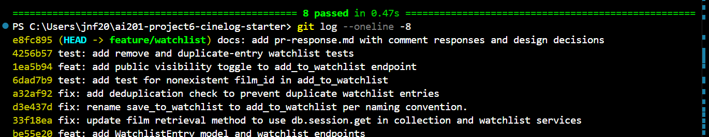

# PR Response Doc — CineLog Watchlist Feature

## AI Usage
<!-- Fill in at the end — how you used AI tools during this project -->

## Comment 1 — Rename
**What I did:** 
Renamed save_to_watchlist() to add_to_watchlist() in services/watchlist_service.py to match the codebase's existing add_to_collection() naming convention. Updated both references in routes/watchlist/watchlist.py; the import on line 8 and the call site on line 32.

**How I verified:**
 Before the rename, I searched the whole project with Get-ChildItem -Recurse -Include *.py | Select-String -Pattern "save_to_watchlist", which returned exactly three references: the definition in watchlist_service.py and the import + call site in watchlist.py. After renaming all three, I re-ran the same search and it returned zero matches, confirming nothing was missed. I then ran pytest tests/ -v and the full suite passed.

## Comment 2 — Deduplication
**What I did:**
Added deduplication to add_to_watchlist() in services/watchlist_service.py, following the existing add_to_collection() pattern in services/collection_service.py. Before creating a new WatchlistEntry, the function now queries WatchlistEntry.query.filter_by(user_id=user_id, film_id=film_id).first(). If a matching entry already exists, it raises a new AlreadyInWatchlistError instead of silently inserting a duplicate row. I defined AlreadyInWatchlistError in the watchlist service to mirror AlreadyInCollectionError in the collection service.

**Why this approach:**
I based the logic on add_to_collection(), which does the same filter_by(...).first() check and raises AlreadyInCollectionError on a hit. When a duplicate is detected, the function raises rather than no-opping, so callers get an explicit signal instead of a silent success. I noted that CollectionEntry also enforces this with a model-level UniqueConstraint, while WatchlistEntry has none. I kept the fix at the service layer as the review requested, but flagged the missing constraint as a possible future hardening. 

**How I verified:** 
Ran pytest tests/ -v; the full suite passes. The dedup path is further exercised by the watchlist tests in Comment 3 / the second stretch test.

## Comment 3 — Missing test
**What I did:**
Created tests/test_watchlist.py and added test_add_to_watchlist_nonexistent_film_raises. The test passes a film_id that doesn't exist in the database and asserts that add_to_watchlist() raises FilmNotFoundError rather than surfacing a raw database integrity error. I copied the app, sample_user, and sample_film fixtures from tests/test_collection.py so the new file follows the same isolated in-memory-DB pattern. 

**How I verified:**
Ran pytest tests/test_watchlist.py -v (the new test passes) and pytest tests/ -v (full suite passes).

**Modeled after:**
test_add_to_collection_nonexistent_film_raises in tests/test_collection.py — same fixture structure, same pytest.raises(FilmNotFoundError) assertion, adapted to the watchlist service.

## Comment 4 — Default visibility
**My position:**
The watchlist has a `public` field but the collection does not. I'm leaning toward keeping the watchlist public but the collection private. A watchlist entry is a film that, for whatever reason, has caught the user's attention enough that they're willing to spend their own time watching it. A collection, by contrast, is a set of films they have already seen. By logging them, the user confirms they've watched them, regardless of what others think of the film.

**Reasoning:**
The watchlist can be thought of as a bookmark list, and we usually aren't protective of that kind of info. That's because most watchlist items are low-stakes, though some are not. It's also worth noting that, since CineLog has no follower system, "public" would mean anyone with the user's watchlist URL can see it, making it a real privacy risk. A collection, on the other hand, is more like your watch history on YouTube, locked behind your profile and private by default.

**Tradeoff acknowledged:**
CineLog is described as a community-based app. Even in real-life communities, not everything is public, but some things are. I understand that making everything private would protect the minority of users whose watchlist reveals something personal. For example, a film chosen for its sensitive premise, or one tied to a specific actor or director they'd rather not broadcast. But those are the exceptions, and the existing `public` toggle lets them opt out. For the common case, defaulting to public serves the app's purpose. If both the watchlist and the collection are private, there's nothing left for a community-based app's users to look through.

## Comment 5 — Sort order
**My position:**
Sort the watchlist by date added (newest first). That is what the maintainer suggested, and it makes sense. CineLog's collection feature already sorts by date added, so making the watchlist match it creates consistency. There could also be an option to sort the list alphabetically, so a user can see if a film has a sequel or a follow-up film that shares a similar name or tagline.

**Reasoning:**
This is how most users have interacted with similar lists, based on general anecdotal usage on other apps. Most people would rather see the most recently added film than an older one that might be outdated or no longer what they're looking for. A watchlist is essentially a "what the user wants to watch next" queue. When a user opens it to pick something for tonight, the film they just added is the most relevant.

**Engagement with reviewer's point:**
I agree with the maintainer, and I'd back their claim with concrete evidence from the codebase. I'd also argue that with this type of list there's a recency bias. A user tends to want the latest film they saved rather than an older one. This also keeps in line with how the CineLog app already runs. The collection service already returns the newest film added first, so sorting the watchlist the same way means users learn one ordering model that holds across both features.

## Comment 6 — Rebase
**What conflicted:**
My `feature/watchlist` branch was created before `main` was refactored to migrate film IDs from integers to UUIDs. When I rebased onto the updated `main`, Git reported two conflicts. The important one was in `models.py`: my branch added a `WatchlistEntry` class whose `film_id` column was defined as `db.Integer`, which was incompatible with the refactored `Film.id`, now a `db.String(36)` UUID. The second was a trivial `add/add` conflict in `.gitignore`, because both `main` and my branch had independently created the file with the same entries.

**How I resolved it:**
In `models.py`, I kept my `WatchlistEntry` class but changed its `film_id` column from `db.Column(db.Integer, db.ForeignKey("film.id"))` to `db.Column(db.String(36), db.ForeignKey("film.id"), nullable=False)`, so it matches the UUID type now used by `Film.id` and `CollectionEntry.film_id`. For `.gitignore`, since both sides listed the same entries, I simply kept one copy and removed the conflict markers. I then staged both files with `git add` and ran `git rebase --continue` to complete the rebase. As follow-up cleanup, I also updated the `add_to_watchlist`/`remove_from_watchlist` docstrings that still described `film_id` as an integer, and fixed the `curl` example in the Stretch 3 section to use a UUID string.

**How I verified no conflict remains:**
After the rebase completed ("Successfully rebased and updated refs/heads/feature/watchlist"), I confirmed the working tree was clean with `git status` and inspected the history with `git log --oneline --graph` to verify my commits now sit cleanly on top of main's UUID refactor. Most importantly, I ran the full test suite with `pytest tests/ -v`, and all 8 tests pass against the UUID-based schema. This confirms the watchlist feature works correctly with the refactored `Film` model and that no unresolved conflict or type mismatch remains.

## Stretch 1 -  remove_from_watchlist Function
**What I did:**
Added a `remove_from_watchlist(user_id, film_id)` function to `watchlist_service.py` that deletes a user's watchlist entry for a given film. It looks up the entry with `WatchlistEntry.query.filter_by(user_id=user_id, film_id=film_id).first()`, and if found, removes it via `db.session.delete(entry)` and `db.session.commit()`, returning `True` to signal success. It mirrors the structure of the existing `remove_from_collection` function, keeping the two services consistent.

**What it does when the film isn't on the watchlist:**
Rather than failing silently or returning `False`, it raises a custom `NotInWatchlistError` with a descriptive message. This follows the same explicit-exception pattern as the existing `AlreadyInWatchlistError` and `FilmNotFoundError`, so callers can handle the "nothing to remove" case deliberately.

**How it follows existing patterns:**
It uses the same `query.filter_by(...).first()` lookup and `db.session` delete/commit flow used elsewhere in the service, defines its `NotInWatchlistError` exception alongside the other custom exceptions, and matches the collection service's remove logic so the codebase stays predictable. It's covered by two tests: `test_remove_from_watchlist_removes_entry` (confirms a present entry is deleted) and `test_remove_from_watchlist_not_present_raises` (confirms `NotInWatchlistError` is raised when the film isn't on the watchlist).

## Stretch 2 - Additional Edge-case Test

**The edge case I chose:**
A test verifying that calling add_to_watchlist twice with the same user and film raises AlreadyInWatchlistError (test_add_to_watchlist_duplicate_raises).

**Why I chose it:** This directly exercises the deduplication logic added in Comment 2 which is the single most important behavioral guarantee of the watchlist. Before this test existed, the dedup path had no coverage, which is exactly the kind of gap where regressions hide. In fact, during this project a bug in the sibling collection service (a reference to the wrong model class in the duplicate-check) went unnoticed precisely because that path wasn't well tested. Adding an explicit duplicate-add test for the watchlist guards against the same class of mistake and ensures the dedup behavior can't silently break in the future.

## Stretch 3- Visibility Toggle
**What I did:**
Added an optional public parameter to add_to_watchlist(user_id, film_id, public=True) in the service, and wired it through the POST /watchlist/<user_id>/add endpoint. The route reads it with data.get("public", True), so callers who omit the field get the existing default behavior. 

**What the default is:**
True, matching the WatchlistEntry.public model default. This preserves backward compatibility. Existing callers and tests are unaffected. 

**How a caller uses it:**
Include a public field in the POST body. For example, to add a private entry:

curl -X POST http://127.0.0.1:5000/watchlist/<user_id>/add \
  -H "Content-Type: application/json" \
-d '{"film_id": "550e8400-e29b-41d4-a716-446655440000", "public": false}'

## PR Description
<!-- Written at the end — feature overview, design decisions, manual testing steps -->